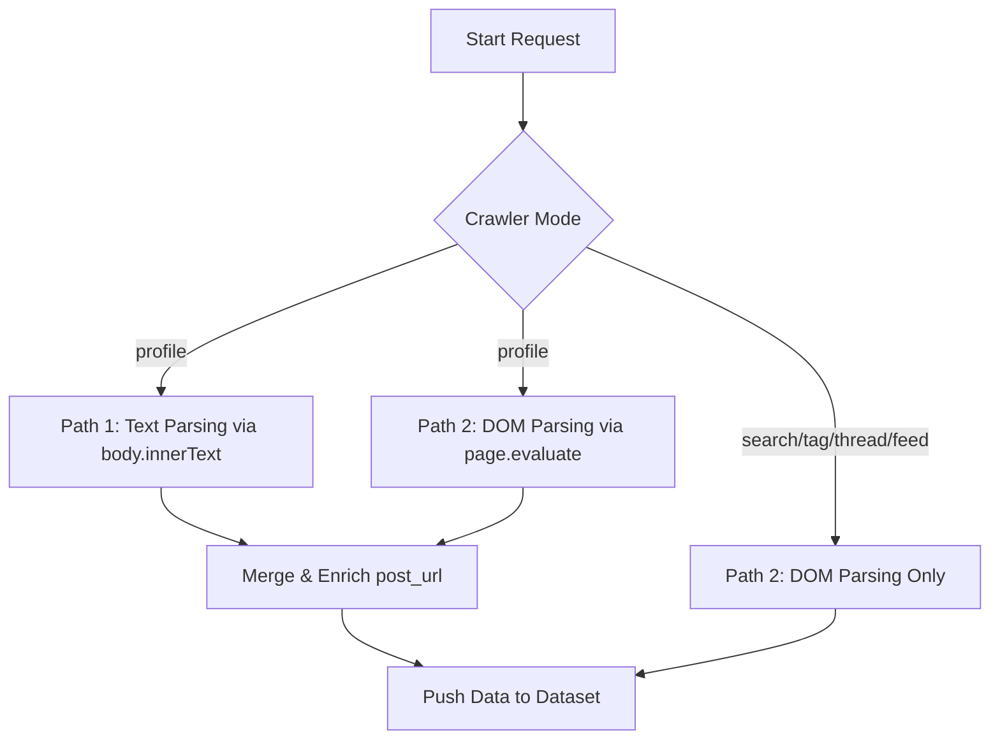

# System Architecture & Dual-Path Parsing Strategy

This document describes the high-level architecture of the Threads Crawler, specifically detailing the **Dual-Path Parsing Strategy** used to retrieve posts and profile details.

---

## Architecture Overview

To circumvent anti-bot detection and dynamically loaded contents, the crawler operates on a dual-path mechanism. It processes the page content concurrently using two distinct methods and merges the results to form a rich dataset.

---

## Dual-Path Parsing Strategy

The core parsing and routing logic resides in [src/routes.ts](file:///c:/Program%20Files/Projects/Apify/threads-crawler/src/routes.ts).

### Path 1: Text-based Parsing (`_parse_posts`)
* **Source**: `body.innerText()` — retrieves the raw visible text of the entire viewport.
* **Extraction**: Recognizes structural text patterns:
  `Author Name` ➔ `Time` ➔ `Content Text` ➔ `Metrics (Likes/Replies/Reposts/Shares)`
* **Advantage**: Fast and resilient. Even if Threads obfuscates DOM class names or nests wrappers deeply, as long as the visible text layout remains intact, parsing succeeds.
* **Limitations**: Cannot extract the unique URL of individual posts (`post_url`) since links are not exposed in the raw visible text stream.

### Path 2: DOM-based Parsing (`_extract_dom_posts`)
* **Source**: `page.evaluate(...)` — executes JavaScript directly inside the browser context.
* **Extraction**: Queries the DOM tree for all anchor tags (`a[href]`) containing URLs matching the Threads post URL regex. Once located, it traverses up the DOM to capture the surrounding post card container and extract post details.
* **Advantage**: Captures the exact `post_url`.
* **Limitations**: Highly sensitive to structural DOM changes, class name refactors, or container shifts by Meta's frontend engineers.

---

## Merge & Enrichment Strategy

For the `profile` mode, both paths run:
1. Text-based parsing extracts posts.
2. DOM-based parsing extracts posts with their corresponding `post_url`.
3. The merge function `_merge_text_posts_with_dom_posts` processes the results:
   - It matches posts by comparing `author`, `posted_at`, and text similarity (`_same_post_text`).
   - If a match is found, the text-parsed post is enriched with the `post_url` from the DOM-parsed post.
   - Unmatched posts from either path are appended.

For `search`, `tag`, `thread`, and `feed` modes, only the DOM-based parsing path is utilized.
